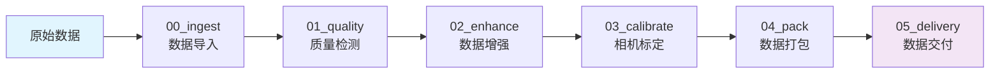
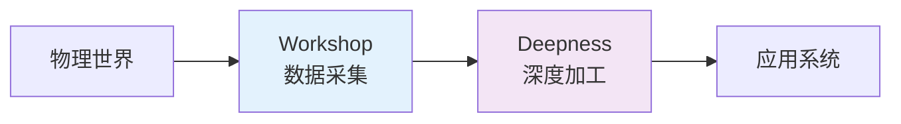

<div align="center">

# Workshop 数据处理平台

> 构建 AI 时代的物理世界数据基础设施

中文 | [English](README_EN.md)

</div>

## 🌟 项目简介

**Workshop V3.0** 是 SpharxWorks 数据智能基础设施工具集（SpharxTools）的核心数据采集和预处理子系统，基于 **AgentOS 微内核架构** 和 **Deepness 模块化设计** 构建，采用五层架构设计。从原始传感器数据到标准化高质量数据集，实现完整处理链路。

作为物理世界数据工厂，Workshop 为后续的深度加工（Deepness）提供高质量的数据基础。

## 💡 核心特性

- **五层架构**：Core → Commons → Orchestration → Services → Pipelines
- **模块化设计**：基于 BasePipeline ABC 的标准化管道框架
- **生产级质量**：100+ 错误码体系，输入验证覆盖率 99%
- **安全内生**：SQL/XSS 检测、路径遍历防护、审计日志
- **可观测性**：分布式追踪、性能监控、健康检查
- **DevOps 完善**：GitHub Actions CI/CD，Docker 多阶段构建

## 🎯 基本理念

- **数据工厂**：标准化处理流程，确保数据质量与一致性
- **质量内建**：从摄入到交付的全链路质量控制与追溯
- **高效运维**：自动化工具链降低人工干预，提升运维效率

<br>

<p align="center">
  <strong>✨ 模块化设计 · 生产级质量 · 自动化运维 ✨</strong>
</p>

<br>

## 🏗️ 系统架构

**V3.0 五层架构** · 参考 AgentOS 和 Deepness 设计模式

```
┌─────────────────────────────────────────────────────────┐
│                    Pipelines 层                          │
│    run_00_ingest → run_01_quality → ... → delivery      │
├─────────────────────────────────────────────────────────┤
│                    Services 层                           │
│         Gateway · Monitor · Exporter                    │
├─────────────────────────────────────────────────────────┤
│                  Orchestration 层                        │
│       Scheduler · TaskQueue · WorkflowEngine            │
├─────────────────────────────────────────────────────────┤
│                     Commons 层                           │
│          Utils · Schemas · Decorators                   │
├─────────────────────────────────────────────────────────┤
│                      Core 层                             │
│  Abstractions · Services · Security · Observability     │
└─────────────────────────────────────────────────────────┘
```

**📐 设计原则** · 基于 AgentOS K-1 至 K-4 架构原则：

- **K-1 极简内核**：核心基础设施层最小化，仅包含必要抽象
- **K-2 接口契约**：BasePipeline ABC 强制标准化生命周期
- **K-3 服务隔离**：每个 Pipeline 模块独立容器化部署
- **K-4 插拔策略**：运行时算法切换与配置热加载

## 🔄 数据处理流程



| 阶段 | 模块 | 核心功能 |
|------|------|---------|
| 1 | **00_ingest** | ROS Bag 解析、图像压缩、隐私脱敏 |
| 2 | **01_quality** | 模糊检测、曝光分析、帧丢弃检测 |
| 3 | **02_enhance** | YOLO 目标检测、HDVS 分割 |
| 4 | **03_calibrate** | 棋盘格相机校准、重投影误差评估 |
| 5 | **04_pack** | 多格式数据集打包 (ROS/COCO/YOLO/VOC/KITTI) |
| 6 | **05_delivery** | OSS 上传、交付通知、完整性校验 |

## 📦 项目结构

### V3.0 核心架构

```
Workshop/
├── workshop/                      # ★ 核心代码包 V3.0
│   ├── __init__.py               # 包入口，导出公共 API
│   ├── core/                     # 核心层
│   │   ├── abstractions/         # 抽象基类 (BasePipeline, IStorageBackend)
│   │   ├── services/             # 核心服务 (Config, Logging, Metrics)
│   │   ├── security/             # 安全服务 (Validation, Security)
│   │   └── observability/        # 可观测性 (Tracing, Performance, Health)
│   ├── orchestration/            # 编排层
│   │   ├── scheduler.py          # 任务调度器
│   │   ├── task_queue.py         # 任务队列
│   │   └── workflow_engine.py    # 工作流引擎
│   └── services/                 # 服务层
│       ├── gateway.py            # API 网关
│       ├── monitor.py            # 监控服务
│       └── exporter.py           # 数据导出
│
├── commons/                      # 通用层
│   ├── utils/                    # 工具函数
│   │   ├── logging_utils.py      # 日志工具
│   │   ├── decorators.py         # 装饰器 (retry, throttle, debounce)
│   │   ├── data_utils.py         # 数据处理 (deep_merge, safe_get)
│   │   └── functional.py         # 函数式工具 (Singleton, Timer, RateLimiter)
│   └── schemas/                  # 数据模式
│       ├── dataset.py            # 数据集模式
│       ├── scene.py              # 场景模式
│       └── sensor_stream.py      # 传感器流模式
│
├── common/                       # 向后兼容层 (V2.0)
│   ├── configs/                  # 配置文件
│   ├── dashboard/                # Web 监控仪表板
│   └── scripts/                  # 兼容脚本
│
├── pipelines/                    # 数据处理管道
│   ├── run_00_ingest/           # 数据导入
│   ├── run_01_quality/          # 质量检测
│   ├── run_02_enhance/          # 数据增强
│   ├── run_03_calibrate/        # 相机校准
│   ├── run_04_pack/             # 数据打包
│   ├── run_05_delivery/         # 数据交付
│   └── streaming/               # 流式处理
│
├── hardware/                     # 硬件抽象层
│   ├── hardware_abstraction.py   # DeviceManager
│   ├── calibration/             # 校准工具
│   └── camera/                  # 相机驱动
│
├── tests/                        # 测试套件
│   ├── unit/                    # 单元测试
│   ├── integration/             # 集成测试
│   └── framework/               # 测试框架
│
├── scripts/                      # 运维工具
│   ├── load_tester.py           # 负载测试
│   ├── ops_toolkit.py           # 运维自动化
│   └── quality_check.py         # 代码质量检查
│
└── docs/                         # 技术文档
    ├── API_REFERENCE.md         # API 参考
    ├── DEVELOPER_GUIDE.md       # 开发者指南
    └── PROJECT_STRUCTURE_V3.md  # 项目结构
```

## 🚀 快速上手

### 📦 环境要求

- **操作系统**：Ubuntu 20.04+ / macOS 11+ / Windows 11 (WSL2)
- **Python**：3.8+ (推荐 3.10)
- **容器**：Docker 20.10+ / Docker Compose 2.0+
- **硬件**：Intel RealSense 相机（可选）

### 🔧 安装与部署

```bash
# 1. 克隆仓库
git clone https://atomgit.com/spharx/workshop.git && cd workshop

# 2. 配置环境变量
cp .env.template .env
# 编辑 .env 文件设置必要参数

# 3. Docker 一键启动
docker-compose up -d

# 4. 验证服务状态
docker-compose ps

# 5. 查看日志
docker-compose logs -f workshop-app
```

### 📚 Python API 使用 (V3.0)

```python
# V3.0 推荐导入方式
from workshop import BasePipeline, ConfigService, LoggingService
from workshop.core.abstractions import PipelineResult, PipelineStatus
from workshop.core.services import ConfigService, LoggingService, MetricsService
from workshop.core.security import ValidationService, SecurityService
from workshop.core.observability import TracingService, PerformanceMonitor
from workshop.orchestration import Scheduler, TaskQueue, WorkflowEngine
from workshop.services import Gateway, Monitor, Exporter
from commons.utils import get_logger, deep_merge, retry
from commons.schemas import DatasetSchema, SceneSchema

# 使用 BasePipeline
class MyPipeline(BasePipeline):
    def _initialize(self):
        self.config = ConfigService()
        self.logger = LoggingService()

    def _execute(self, input_data) -> PipelineResult:
        return PipelineResult(success=True, data={})

    def _cleanup(self):
        pass

# V2.0 兼容导入 (显示 DeprecationWarning)
from common.core import BasePipeline, ConfigService
```

## 🎯 核心模块详解

### BasePipeline - 管道抽象基类

```python
from workshop.core.abstractions import BasePipeline, PipelineResult

class MyPipeline(BasePipeline):
    """标准化 Pipeline 实现"""

    def _initialize(self):
        """初始化配置和资源"""
        self.config = ConfigService()
        self.logger = LoggingService()

    def _execute(self, input_data) -> PipelineResult:
        """执行业务逻辑"""
        return PipelineResult(success=True, data={})

    def _cleanup(self):
        """释放资源"""
        pass
```

### ConfigService - 配置管理

```python
from workshop.core.services import ConfigService

config = ConfigService()

# 多级配置合并
value = config.get('blur_threshold', default=100)
```

### TracingService - 分布式追踪

```python
from workshop.core.observability import TracingService

tracing = TracingService()

with tracing.span("process_data"):
    # 业务逻辑
    pass
```

## 🧪 测试与质量

### 测试覆盖

```bash
# 单元测试
python -m pytest tests/unit/ -v

# 集成测试
python -m pytest tests/integration/ -v

# 负载测试
python scripts/load_tester.py --test-type load -c 20

# 代码质量检查
python scripts/quality_check.py
```

## 📚 文档资源

| 文档 | 说明 |
|------|------|
| [📘 项目结构 V3](docs/PROJECT_STRUCTURE_V3.md) | V3.0 目录布局详解 |
| [📊 重构计划](docs/REFACTORING_PLAN_V3.md) | V3.0 重构计划 |
| [🏗️ 架构决策](docs/ARCHITECTURE_DECISION_RECORDS.md) | ADR 记录 |
| [🚀 开发者指南](docs/DEVELOPER_GUIDE.md) | 开发者入门指南 |
| [📦 API 参考](docs/API_REFERENCE.md) | API 文档 |

## 🤝 贡献指南

欢迎提交 Issue 和 Pull Request！

### 开发流程

```bash
# 1. Fork 项目
# 2. 创建功能分支
git checkout -b feature/AmazingFeature

# 3. 提交更改
git commit -m 'Add some AmazingFeature'

# 4. 推送到分支
git push origin feature/AmazingFeature

# 5. 开启 Pull Request
```

### 代码规范

- 遵循 PEP 8 Python 编码规范
- 使用 Black 格式化代码
- 类型注解覆盖率 >95%
- 单元测试覆盖新功能

## 🚀 与 Deepness 集成



- **数据输出**：生成 Deepness 兼容的标准输入格式
- **触发机制**：文件系统事件监听或 API 调用
- **状态同步**：处理进度回调和状态通知
- **质量保证**：确保输入数据满足深度加工要求

<br>

<p align="center">
  <strong>☀️ 每处理一份数据，都是为智能时代点亮一盏灯 ☀️</strong>
</p>

<br>

## 🤝 参与贡献

这是我们正在走进的未来。

> "From data intelligence emerges."
> "始于数据，终于智能。"

### 💫 贡献方式

- 🐛 **发现问题** → 报告 Bug
- 💡 **提出想法** → 新功能建议
- 📝 **分享知识** → 完善文档
- 🔧 **编写代码** → 提交 PR

**主要平台**：[AtomGit](https://atomgit.com/spharx/workshop)（推荐） · [Gitee](https://gitee.com/spharx/workshop) · [GitHub](https://github.com/SpharxTeam/Workshop)

<br><br>

<p align="center">

**🔥 微微的灯火照不亮前路，但能指引我们前行的方向 🔥**

</p>

<br><br>

## 📜 许可证

本项目采用 **GPL-3.0 开源协议 + 商业闭源授权** 双轨授权模式。

### 开源授权（GPL-3.0）

个人学习、学术研究、非商业原型验证、开源社区贡献等非商业场景，可免费使用本项目。

详见 [LICENSE-GPL-3.0](LICENSE-GPL-3.0)

### 商业闭源授权

任何将本项目用于闭源商业产品、商业服务、盈利性项目的行为，均需提前向 SPHARX 极光感知科技申请商业授权。

详见 [LICENSE-COMMERCIAL](LICENSE-COMMERCIAL)

授权申请联系：
- 官方邮箱：lidecheng@spharx.cn、wangliren@spharx.cn
- 官方网站：https://spharx.cn

---

<div align="center">

**From data intelligence emerges.**

**始于数据，终于智能。**

<a href="https://atomgit.com/spharx/workshop">AtomGit</a> ·
<a href="https://gitee.com/spharx/workshop">Gitee</a> ·
<a href="https://github.com/SpharxTeam/Workshop">GitHub</a> ·
<a href="https://spharx.cn">官方网站</a>

© 2026 SPHARX Ltd. All Rights Reserved.

</div>
