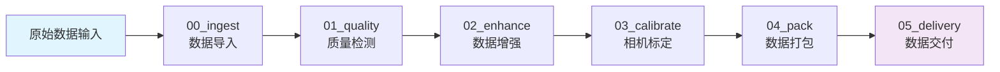
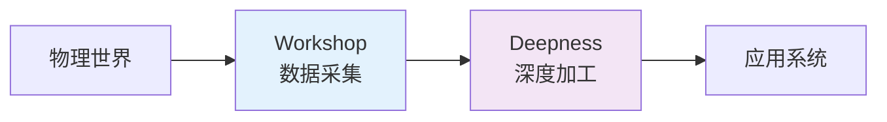

# Workshop 数据处理平台

Workshop 是 SpharxWorks 平台的核心数据采集和预处理子系统，采用模块化、容器化的架构设计，实现了从原始传感器数据到标准化高质量数据集的完整处理链路。作为物理世界数据工厂，Workshop 为后续的深度加工（Deepness）提供高质量的数据基础。

*"From data intelligence emerges"*
*"始于数据，终于智能"*

## 🏗️ 系统架构



## 📁 项目结构

```
workshop/
├── base/                    # 基础镜像构建
│   └── Dockerfile          # Python 3.10 基础环境
├── common/                  # 公共组件
│   ├── configs/            # 配置文件
│   │   ├── modules/        # 各模块配置
│   │   │   ├── 00_ingest.yaml     # 数据导入配置
│   │   │   ├── 01_quality.yaml    # 质量检测配置
│   │   │   ├── 02_enhance.yaml    # 数据增强配置
│   │   │   ├── 03_calibrate.yaml  # 相机标定配置
│   │   │   ├── 04_pack.yaml       # 数据打包配置
│   │   │   └── 05_delivery.yaml   # 数据交付配置
│   │   ├── deps.lock       # 依赖版本锁定
│   │   ├── logging.yaml    # 日志配置
│   │   └── pipeline_config.yaml   # 全局流水线配置
│   ├── schemas/            # 数据模型定义
│   │   ├── __init__.py
│   │   ├── dataset.py      # 数据集模型
│   │   ├── scene.py        # 场景元数据
│   │   └── sensor_stream.py # 传感器流模型
│   └── scripts/            # 公共脚本工具
│       ├── config_loader.py       # 配置加载器
│       └── data_io/               # 数据IO工具
├── docs/                   # 项目文档
│   ├── WORKSHOP_ARCH.md           # 系统架构设计
│   ├── PROGRESS.md                # 项目进度报告
│   ├── CODING_STANDARDS.md        # 编码规范
│   ├── CONTRIBUTING.md            # 贡献指南
│   └── ...                        # 其他技术文档
├── hardware/               # 硬件支持
│   ├── calibration/               # 标定工具
│   ├── camera/                    # 相机驱动
│   └── scripts/                   # 硬件配置脚本
├── partdata/               # 数据目录
│   ├── deps/               # 编译依赖
│   ├── models/             # 模型权重
│   │   └── yolov8n.pt             # YOLOv8 检测模型
│   ├── logs/               # 运行日志
│   ├── tests/              # 测试数据
│   ├── raw/                # 原始输入数据
│   ├── workshop_output/    # 处理中间结果
│   └── datasets/           # 最终数据集
├── pipelines/              # 处理管道模块
│   ├── 00_ingest/         # 数据导入模块
│   │   ├── Dockerfile
│   │   ├── requirements.txt
│   │   └── runner.py
│   ├── 01_quality/        # 质量检测模块
│   │   ├── Dockerfile
│   │   ├── requirements.txt
│   │   └── runner.py
│   ├── 02_enhance/        # 数据增强模块
│   │   ├── Dockerfile
│   │   ├── requirements.txt
│   │   └── runner.py
│   ├── 03_calibrate/      # 相机标定模块
│   │   ├── Dockerfile
│   │   ├── requirements.txt
│   │   └── runner.py
│   ├── 04_pack/           # 数据打包模块
│   │   ├── Dockerfile
│   │   ├── requirements.txt
│   │   └── runner.py
│   └── 05_delivery/       # 数据交付模块
│       ├── Dockerfile
│       ├── requirements.txt
│       └── runner.py
├── scripts/                # 运维脚本
│   ├── build/             # 构建相关脚本
│   ├── deploy/            # 部署相关脚本
│   ├── dispose/           # 清理相关脚本
│   │   ├── dispose_build_all.sh
│   │   └── dispose_deploy.sh
│   ├── download/          # 下载相关脚本
│   │   ├── download_deps.sh
│   │   ├── download_models.sh
│   │   └── download_sources.sh
│   ├── init/              # 初始化脚本
│   │   └── init_project.sh
│   ├── lib/               # 公共函数库
│   │   └── common.sh
│   ├── pipeline/          # 流水线控制脚本
│   └── utils/             # 实用工具脚本
├── tests/                  # 测试套件
│   ├── unit/              # 单元测试
│   ├── integration/       # 集成测试
│   └── docs/              # 测试文档
├── docker-compose.yml      # 服务编排配置
├── Makefile               # 构建自动化
├── .env.template          # 环境变量模板
└── README.md              # 本文档
```

## 🚀 快速开始

### 环境准备

```bash
# 1. 克隆项目
git clone https://github.com/spharx/spharxworks.git
cd spharxworks/workshop
cd workshop

# 2. 项目初始化
./scripts/init/init_project.sh

# 3. 配置环境变量
cp .env.template .env
# 编辑 .env 文件设置必要参数

# 4. 下载依赖和模型
./scripts/download/download_deps.sh
./scripts/download/download_models.sh
```

### 构建和部署

```bash
# 一键构建所有镜像
make all

# 或单独构建模块
make ingest      # 构建数据导入模块
make quality     # 构建质量检测模块
make enhance     # 构建数据增强模块
make calibrate   # 构建相机标定模块
make pack        # 构建数据打包模块

# 启动基础处理流程（不含交付模块）
docker-compose up -d ingest quality enhance calibrate pack

# 启动完整流程（包含交付模块）
docker-compose --profile delivery up -d

# 查看服务状态
docker-compose ps

# 查看服务日志
docker-compose logs -f [service-name]

# 停止所有服务
docker-compose down
```

### 清理环境

```bash
# 删除所有 workshop 镜像
make clean

# 删除镜像并清理构建缓存
make clean-all

# 清理部署文件
./scripts/dispose/dispose_deploy.sh
```

## 🛠️ 核心功能模块

### 00_ingest - 数据导入模块
- **功能**: 接收和解析原始传感器数据
- **特性**: 隐私脱敏处理、标准化数据结构生成
- **输入**: ROS Bag 文件、RealSense 数据流
- **输出**: 标准化目录结构（rgb/、depth/、timestamps.csv等）
- **关键技术**: Intel RealSense SDK、OpenCV

### 01_quality - 质量检测模块
- **功能**: 多层次数据质量评估
- **特性**: 硬件层检测（模糊度、曝光、帧率）、语义层分析（预留）
- **输出**: quality_report.json、质量指标数据
- **配置**: 可调节的质量阈值和检测参数

### 02_enhance - 数据增强模块
- **功能**: 基于目标检测的数据增强和标注
- **特性**: YOLOv8 实时目标检测、图像去噪、自动标注生成
- **输出**: COCO 格式标注文件、增强后的图像
- **模型**: yolov8n.pt（可替换为其他 YOLOv8 模型）

### 03_calibrate - 相机标定模块
- **功能**: 相机内外参标定
- **特性**: 棋盘格标定法、标定精度验证
- **输出**: 内参矩阵、外参矩阵、标定报告
- **支持**: 单相机内参标定（外参标定预留）

### 04_pack - 数据打包模块
- **功能**: 标准化数据集打包
- **特性**: ROS Bag 格式、COCO 格式、数据完整性校验
- **输出**: 标准化数据集、SHA256 校验和
- **验证**: 自动完整性检查和格式验证

### 05_delivery - 数据交付模块
- **功能**: 数据集上传和交付
- **特性**: OSS 对象存储、SFTP 传输、交付状态通知
- **方式**: 阿里云 OSS、SFTP、本地存储
- **配置**: 支持多种交付渠道和重试机制

## 📊 技术栈

### 核心技术
- **容器化**: Docker + Docker Compose
- **编程语言**: Python 3.10+
- **核心框架**: 
  - OpenCV (计算机视觉)
  - PyTorch (深度学习)
  - YOLOv8 (目标检测)
  - NumPy (数值计算)
- **硬件支持**: Intel RealSense SDK
- **配置管理**: YAML + 环境变量
- **监控告警**: Streamlit Web 面板（预留）

### 依赖管理
```yaml
# 通过 deps.lock 文件锁定版本
torch>=1.13.0
torchvision>=0.14.0
opencv-python>=4.8.0
ultralytics>=8.0.0
numpy>=1.24.0
pyyaml>=6.0
```

## ⚙️ 配置管理

### 模块配置示例

**数据导入配置** (`common/configs/modules/00_ingest.yaml`):
```yaml
privacy:
  enable_blur: true
  blur_kernel_size: 15
  face_detection: true

data_format:
  output_structure: "standard"
  compression_level: 6
```

**数据增强配置** (`common/configs/modules/02_enhance.yaml`):
```yaml
yolo:
  model: "yolov8n.pt"
  conf_threshold: 0.25
  iou_threshold: 0.45

enhancement:
  enable_denoising: true
  noise_reduction_strength: 0.3
```

### 环境变量配置
```bash
# .env 文件关键配置
LOG_LEVEL=INFO              # 日志级别
MAX_WORKERS=4               # 最大工作进程数
GPU_ENABLED=false           # GPU加速开关
YOLO_MODEL=yolov8n.pt       # YOLO模型文件
QUALITY_THRESHOLD=0.8       # 质量检测阈值
```

## 🎯 最佳实践

### 目录结构管理
```bash
# 所有大型数据存储在 partdata/ 目录
# 通过 Docker 卷挂载方式使用数据
# 确保镜像轻量化和数据持久化分离

partdata/
├── raw/              # 原始输入数据（只读挂载）
├── workshop_output/  # 处理中间结果
├── datasets/         # 最终数据集
├── models/           # 模型权重
└── logs/             # 运行日志
```

### 依赖管理策略
```bash
# 1. 使用 deps.lock 文件锁定依赖版本
# 2. 通过 download_deps.sh 脚本下载依赖到本地
# 3. Docker 构建时直接 COPY 本地依赖，避免网络依赖
# 4. 定期更新依赖版本并测试兼容性
```

### 配置管理规范
```bash
# 1. 所有可配置参数都在 common/configs/ 目录下
# 2. 模块配置: common/configs/modules/{module_name}.yaml
# 3. 全局配置: common/configs/pipeline_config.yaml
# 4. 环境变量: 通过 .env 文件管理运行时参数
```

### 性能优化建议
```bash
# 1. 合理设置资源限制（内存、CPU）
# 2. 启用健康检查确保服务稳定
# 3. 使用 tmpfs 提升临时文件性能
# 4. 配置适当的重启策略
# 5. 监控资源使用情况及时调整
```

## 🔒 安全与合规

### 容器安全
- **用户权限**: 使用非 root 用户运行容器
- **最小权限**: 只安装必要依赖，移除不必要能力
- **只读文件系统**: 关键目录设置为只读
- **安全选项**: 启用安全强化选项

### 数据保护
- **隐私处理**: 自动人脸模糊和敏感信息过滤
- **访问控制**: 容器内最小权限原则
- **数据加密**: 敏感配置文件加密存储
- **完整性校验**: SHA256 校验和验证

### 合规性
- **审计日志**: 完整的操作日志记录
- **版本控制**: 配置和代码版本管理
- **数据留存**: 符合数据保护法规要求

## 📈 系统监控

### 服务状态监控
```bash
# 查看所有服务状态
docker-compose ps

# 查看特定服务日志
docker-compose logs -f ingest

# 实时监控资源使用
docker stats

# 健康检查
docker-compose exec ingest python -c "import sys; print('Service OK')"
```

### Web 监控面板（预留）
```bash
# 启动监控面板
streamlit run dashboard/app.py

# 访问地址: http://localhost:8501
# 功能: 实时状态展示、处理进度跟踪、性能指标监控
```

## 📚 文档资源

### 核心文档
- [📘 系统架构设计](docs/WORKSHOP_ARCH.md) - 详细架构说明
- [📊 项目进度报告](docs/PROGRESS.md) - 开发里程碑和现状
- [🛠️ 编码规范](docs/CODING_STANDARDS.md) - 开发标准和规范
- [🤝 贡献指南](docs/CONTRIBUTING.md) - 参与项目开发
- [🔒 安全政策](docs/SECURITY.md) - 安全实践和漏洞报告

### 技术参考
- [🐳 Docker 部署指南](docs/DOCKER_DEPLOYMENT.md) - 容器化部署说明
- [⚙️ 配置管理手册](docs/CONFIGURATION.md) - 配置文件详解
- [🧪 测试框架说明](docs/TESTING.md) - 测试策略和用例
- [📈 性能优化指南](docs/PERFORMANCE.md) - 性能调优建议

## 🤝 贡献指南

欢迎提交 Issue 和 Pull Request！

### 开发流程
1. **Fork 项目**
2. **创建功能分支** (`git checkout -b feature/AmazingFeature`)
3. **提交更改** (`git commit -m 'Add some AmazingFeature'`)
4. **推送到分支** (`git push origin feature/AmazingFeature`)
5. **开启 Pull Request**

### 代码规范
- 遵循 PEP 8 Python 编码规范
- 使用 Black 格式化代码
- 编写单元测试覆盖新功能
- 更新相关文档说明

### 测试要求
```bash
# 运行单元测试
pytest tests/unit/

# 运行集成测试
pytest tests/integration/

# 代码质量检查
flake8 .
black --check .
```

## 📄 许可证

本项目采用 MIT 许可证 - 查看 [LICENSE](LICENSE) 文件了解详情

## 📞 联系方式

**项目维护**: SPHARX极光感知科技
**技术支持**: support@spharx.cn
**项目主页**: [SpharxWorks GitHub](https://github.com/spharx/spharxworks)
**社区交流**: [GitHub Issues & Discussions](https://github.com/spharx/spharxworks/issues)

## 🚀 与 Deepness 集成

Workshop 作为 SpharxWorks 的数据采集前端，与 Deepness 深度加工系统紧密集成：



- **数据输出**: 生成 Deepness 兼容的标准输入格式
- **触发机制**: 文件系统事件监听或 API 调用
- **状态同步**: 处理进度回调和状态通知
- **质量保证**: 确保输入数据满足深度加工要求

---

<p align="center">
  <strong>构建 AI 时代的物理世界数据基础设施</strong>
</p>

<p align="center">
  <em>From data intelligence emerges</em>
</p>
<p align="center">
  <em>始于数据，终于智能</em>
</p>

<p align="center">
  <a href="https://github.com/spharx/spharxworks/tree/main/workshop">GitHub</a> ·
  <a href="https://docs.spharx.cn/workshop">文档</a> ·
  <a href="https://github.com/spharx/spharxworks/issues">问题反馈</a>
</p>


## 许可证
SpharxWorks 采用 **GPL-3.0 开源协议 + 商业闭源授权** 双轨授权模式，您可根据自身使用场景选择对应授权。

### 开源授权（GPL-3.0）
个人学习、学术研究、非商业原型验证、开源社区贡献等非商业场景，可免费使用本项目，需严格遵守GPL-3.0协议的开源义务，完整协议详见 [LICENSE-GPL-3.0](LICENSE-GPL-3.0)。

### 商业闭源授权
任何将本项目用于闭源商业产品、商业服务、盈利性项目的行为，均需提前向SPHARX极光感知科技申请商业授权，获得闭源使用豁免、官方技术支持、定制化服务等权益。

商业授权详情详见 [LICENSE-COMMERCIAL](LICENSE-COMMERCIAL)，授权申请请联系：
- 官方邮箱：lidecheng@spharx.cn、wangliren@spharx.cn
- 官方网站：https://spharx.cn

© 2026 SPHARX极光感知科技，保留所有权利。