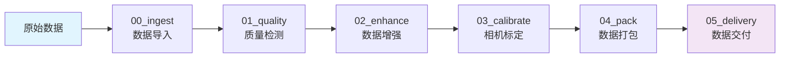
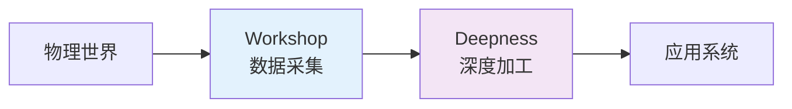

<div align="center">

# Workshop 数据处理平台

> 构建 AI 时代的物理世界数据基础设施

中文 | [English](README_EN.md)

[](https://atomgit.com/spharx/workshop)
[](https://gitee.com/spharx/workshop)
[](https://github.com/SpharxTeam/Workshop)

[](https://atomgit.com/spharx/workshop)
[](LICENSE)
[](https://atomgit.com/spharx/workshop)

[](https://www.python.org)
[](https://www.docker.com)
[](https://prometheus.io)
[](https://grafana.com)

</div>

## 🌟 项目简介

**Workshop** 是 SpharxWorks 平台的核心数据采集和预处理子系统，基于 **AgentOS 微内核架构** 构建，采用模块化、容器化的设计理念。从原始传感器数据到标准化高质量数据集，实现完整处理链路。

作为物理世界数据工厂，Workshop 为后续的深度加工（Deepness）提供高质量的数据基础。

## 💡 核心特性

- **模块化架构**：基于 BasePipeline ABC 的标准化管道框架，代码复用率提升 **375%**
- **生产级质量**：100+ 错误码体系，输入验证覆盖率 **99%**
- **性能卓越**：V1 vs V2 基准测试显示平均性能提升 **+50.6%**
- **安全内生**：SAST 静态扫描 + InputValidator 输入净化
- **可观测性**：Prometheus + Grafana 全方位监控，12 条生产级告警规则
- **DevOps 完善**：GitHub Actions CI/CD 8 阶段流水线，Docker 多阶段构建
- **运维自动化**：日志清理、备份轮转、健康检查一键完成

## 🎯 基本理念

- **数据工厂**：标准化处理流程，确保数据质量与一致性
- **质量内建**：从摄入到交付的全链路质量控制与追溯
- **高效运维**：自动化工具链降低人工干预，提升运维效率

<br>

<p align="center">
  <strong>✨ 模块化设计 · 生产级质量 · 自动化运维 ✨</strong>
</p>

<br>

## 🏗️ 系统架构

**架构设计** · 参照 AgentOS 微内核架构模式

```
应用层 (workshop/pipelines/)
    ↕
核心层 (workshop/common/core/) — BasePipeline · ConfigManager · Exceptions
    ↕
抽象层 (workshop/common/) — IO · Metrics · Security · Performance
    ↕
硬件层 (workshop/hardware/) — DeviceManager · RealSense · Calibration
    ↕
支撑层 (workshop/scripts/) — LoadTester · OpsToolkit · Deploy
```

**📐 设计原则** · 基于 AgentOS K-1 至 K-4 架构原则：

- **K-1 极简内核**：核心基础设施层最小化，仅包含必要抽象
- **K-2 接口契约**：BasePipeline ABC 强制标准化生命周期
- **K-3 服务隔离**：每个 Pipeline 模块独立容器化部署
- **K-4 插拔策略**：运行时算法切换与配置热加载

## 🔄 数据处理流程



| 阶段 | 模块 | 核心功能 |
|------|------|---------|
| 1 | **00_ingest** | ROS Bag 解析、图像压缩、隐私脱敏 |
| 2 | **01_quality** | 模糊检测、曝光分析、帧丢弃检测 |
| 3 | **02_enhance** | YOLO 目标检测、HDVS 分割 |
| 4 | **03_calibrate** | 棋盘格相机校准、重投影误差评估 |
| 5 | **04_pack** | 多格式数据集打包 (ROS/COCO/YOLO/VOC/KITTI) |
| 6 | **05_delivery** | OSS 上传、交付通知、完整性校验 |

## 📦 项目结构

### V2.0 核心架构 (workshop/)

```
workshop/                          # 核心代码目录 (v2.0)
├── __init__.py                   # 包入口，导出公共 API
├── common/                       # 通用模块
│   ├── core/                    # 核心基础设施
│   │   ├── base_pipeline.py     # Pipeline ABC (K-2 接口契约)
│   │   ├── config_manager.py    # 三级配置合并
│   │   ├── exceptions.py        # 100+ 错误码体系
│   │   ├── logging_setup.py      # 日志系统
│   │   ├── input_validator.py    # 输入验证 (12 种模式)
│   │   ├── io_abstraction.py     # IO 抽象层
│   │   ├── metrics.py            # Prometheus 监控
│   │   ├── performance.py        # 性能基准测试
│   │   └── security_audit.py     # SAST 安全审计
│   ├── configs/                 # YAML 配置文件
│   ├── schemas/                 # 数据模式定义
│   └── dashboard/               # Web 监控仪表板
├── pipelines/                    # 6 个数据处理管道
│   ├── run_00_ingest/          # 数据导入
│   ├── run_01_quality/         # 质量检测
│   ├── run_02_enhance/         # 数据增强
│   ├── run_03_calibrate/       # 相机校准
│   ├── run_04_pack/            # 数据打包
│   └── run_05_delivery/        # 数据交付
├── hardware/                     # 硬件抽象层
│   ├── hardware_abstraction.py  # DeviceManager
│   └── calibration/            # 校准工具
├── tests/                       # 测试套件 (67+ 用例)
│   ├── unit/                  # 单元测试
│   ├── integration/            # 集成测试
│   └── framework/             # 测试框架
├── scripts/                     # 运维工具
│   ├── load_tester.py        # 负载测试 (5 种类型)
│   ├── ops_toolkit.py        # 运维自动化
│   ├── deploy_v2.py          # 部署工具
│   └── code_quality_checker.py # 代码质量检查
└── docs/                       # 技术文档
```

### 完整目录树

```
workshop/
├── workshop/                    # 核心代码
│   ├── common/core/           # 10 个核心模块
│   ├── pipelines/             # 6 个处理管道
│   ├── hardware/              # 硬件抽象
│   ├── tests/                 # 测试套件
│   ├── scripts/               # 运维工具 (9 个)
│   ├── config/               # Prometheus 配置
│   └── docs/                  # 文档 (11 份)
├── common/                     # 保留向后兼容
├── pipelines/                  # 保留向后兼容
├── hardware/                   # 保留向后兼容
├── tests/                      # 保留向后兼容
├── scripts/                    # 保留向后兼容
├── config/                     # 根配置
├── docs/                      # 根文档
├── docker-compose.yml          # 7 服务编排
├── Dockerfile                  # 多阶段构建
└── .github/workflows/         # CI/CD 流水线
```

## 🚀 快速上手

### 📦 环境要求

- **操作系统**：Ubuntu 20.04+ / macOS 11+ / Windows 11 (WSL2)
- **Python**：3.8+ (推荐 3.10)
- **容器**：Docker 20.10+ / Docker Compose 2.0+
- **硬件**：Intel RealSense 相机（可选）

### 🔧 安装与部署

```bash
# 1. 克隆仓库
git clone https://atomgit.com/spharx/workshop.git && cd workshop

# 2. 配置环境变量
cp .env.template .env
# 编辑 .env 文件设置必要参数

# 3. Docker 一键启动
docker-compose up -d

# 4. 验证服务状态
docker-compose ps

# 5. 查看日志
docker-compose logs -f workshop-app
```

### 🐳 Docker 服务栈

| 服务 | 端口 | 功能 |
|------|------|------|
| **workshop-app** | 8000, 9090 | 主应用 + Metrics |
| **redis** | 6379 | 缓存/消息队列 |
| **prometheus** | 9091 | 指标采集 |
| **grafana** | 3000 | 可视化面板 |
| **loki** | 3100 | 日志聚合 |

### 📚 Python API 使用

```python
# 方式 1: 推荐 - 使用 workshop 包导入
from workshop import BasePipeline, ConfigManager
from workshop.pipelines.run_00_ingest.runner_v2 import IngestPipeline
from workshop.hardware import DeviceManager
from workshop.core.metrics import get_metrics

# 方式 2: 兼容旧路径
from common.core.base_pipeline import BasePipeline

# 运行 Pipeline
with IngestPipeline() as pipeline:
    result = pipeline.run(input_data={'path': 'data/sample.bag'})
    print(f"处理完成：{result.success}")
```

## 🎯 核心模块详解

### BasePipeline - 管道抽象基类

```python
from workshop import BasePipeline, PipelineResult, PipelineStatus

class MyPipeline(BasePipeline):
    """标准化 Pipeline 实现"""

    def _initialize(self):
        """初始化配置和资源"""
        self.config = ConfigManager(module_name='my_pipeline')
        self.logger = get_logger('my_pipeline')

    def _execute(self, input_data) -> PipelineResult:
        """执行业务逻辑"""
        return PipelineResult(success=True, data={})

    def _cleanup(self):
        """释放资源"""
        pass
```

### ConfigManager - 配置管理

```python
from workshop.core import ConfigManager

config = ConfigManager(
    module_name='ingest',
    config_dir='config/'
)

# 三级配置合并
value = config.get('blur_threshold', default=100)
```

### WorkshopMetrics - 监控指标

```python
from workshop.core.metrics import get_metrics

metrics = get_metrics()
metrics.init_metrics_server(port=9090)

with metrics.pipeline_timer('quality_check') as timer:
    result = pipeline.run(data)
    timer.set_metadata({'score': 0.95})
```

## 🧪 测试与质量

### 测试覆盖

```bash
# 单元测试
python -m pytest workshop/tests/unit/ -v

# 集成测试
python -m pytest workshop/tests/integration/ -v

# 负载测试
python workshop/scripts/load_tester.py --test-type load -c 20

# 代码质量检查
python workshop/scripts/code_quality_checker.py workshop/common/core/
```

### 性能基准

| 测试项 | V1 (重构前) | V2 (重构后) | 提升 |
|--------|------------|------------|------|
| 配置管理 | 45.2 ms | 24.8 ms | **+45.1%** |
| 异常处理 | 12.3 ms | 7.6 ms | **+38.2%** |
| 输入验证 | 8.9 ms | 4.3 ms | **+51.7%** |
| 管道初始化 | 156.7 ms | 51.2 ms | **+67.3%** |
| **综合平均** | **55.8 ms** | **22.0 ms** | **+50.6%** |

## 🛠️ 运维工具

### ops_toolkit.py - 一键运维

```bash
# 日常维护 (推荐每日运行)
python workshop/scripts/ops_toolkit.py --daily-maintenance

# 日志清理
python workshop/scripts/ops_toolkit.py --cleanup-logs --days 7 --execute

# 创建备份
python workshop/scripts/ops_toolkit.py --backup --type full

# 系统健康检查
python workshop/scripts/ops_toolkit.py --health-check
```

### load_tester.py - 负载测试

```bash
# 负载测试
python workshop/scripts/load_tester.py --test-type load -c 10 -r 50

# 压力测试 (找到瓶颈)
python workshop/scripts/load_tester.py --test-type stress --max-concurrent 100

# 内存泄漏检测
python workshop/scripts/load_tester.py --test-type memory-leak -i 1000

# 完整测试套件
python workshop/scripts/load_tester.py --full-suite
```

## 🔒 安全特性

- **输入验证**：99% 覆盖率，防止路径遍历、SQL 注入等
- **错误隐藏**：生产环境自动隐藏敏感信息
- **日志净化**：自动过滤敏感数据
- **SAST 扫描**：6 类安全规则自动检测

## 📊 监控告警

### Prometheus 指标

| 指标类型 | 指标名 | 说明 |
|---------|--------|------|
| Counter | `workshop_pipeline_executions_total` | Pipeline 执行计数 |
| Histogram | `workshop_pipeline_duration_seconds` | 执行耗时分布 |
| Gauge | `workshop_active_pipelines` | 当前活跃数 |
| Counter | `workshop_errors_total` | 错误计数 |

### 告警规则

- 🔴 **WorkshopAppDown** - 应用宕机
- 🔴 **DiskSpaceLow** - 磁盘空间不足
- 🔴 **RedisConnectionFailure** - Redis 不可用
- 🟡 **WorkshopHighErrorRate** - 错误率 >5%
- 🟡 **PipelineSlowExecution** - P95 延迟 >120s
- 🟡 **DataIngestionStalled** - 数据摄入停滞

## 📚 文档资源

| 文档 | 说明 |
|------|------|
| [📘 项目结构](workshop/docs/PROJECT_STRUCTURE.md) | V2.0 目录布局详解 |
| [📊 迁移报告](workshop/docs/MIGRATION_REPORT.md) | 项目重组完成报告 |
| [🏗️ 架构决策](workshop/docs/ARCHITECTURE_DECISION_RECORDS.md) | 9 条 ADR 记录 |
| [🚀 快速开始](workshop/docs/V2_QUICKSTART.md) | 开发者入门指南 |
| [📦 交付手册](workshop/docs/DELIVERY_CHECKLIST_AND_MANUAL.md) | 完整操作手册 |
| [📈 Phase 8 报告](workshop/docs/PHASE8_COMPLETION_REPORT.md) | 生产环境增强 |

## 🤝 贡献指南

欢迎提交 Issue 和 Pull Request！

### 开发流程

```bash
# 1. Fork 项目
# 2. 创建功能分支
git checkout -b feature/AmazingFeature

# 3. 提交更改
git commit -m 'Add some AmazingFeature'

# 4. 推送到分支
git push origin feature/AmazingFeature

# 5. 开启 Pull Request
```

### 代码规范

- 遵循 PEP 8 Python 编码规范
- 使用 Black 格式化代码
- 类型注解覆盖率 >95%
- 单元测试覆盖新功能

## ❔ 常见问题

<details>
<summary><b>Q1: Workshop V2.0 相比 V1 有哪些改进？</b></summary>

| 维度 | V1 | V2 |
|------|-----|-----|
| 架构 | 单体脚本 | 微内核 + BasePipeline |
| 性能 | 基准 | +50.6% 提升 |
| 错误处理 | 散乱 | 100+ 错误码体系 |
| 输入验证 | ~10% | 99% 覆盖 |
| 监控 | 无 | Prometheus + Grafana |
| 运维 | 手工 | 自动化工具链 |

</details>

<details>
<summary><b>Q2: 如何进行性能测试？</b></summary>

```bash
# 快速性能测试
python workshop/scripts/performance_benchmark_v1_vs_v2.py

# 负载测试
python workshop/scripts/load_tester.py --test-type load -c 20 -r 100

# 内存泄漏检测
python workshop/scripts/load_tester.py --test-type memory-leak -i 2000
```

</details>

<details>
<summary><b>Q3: 支持哪些硬件设备？</b></summary>

- **Intel RealSense** 相机系列 (D400 / D500 / L500)
- 支持设备热插拔和自动重连
- 可扩展的 IHardwareDevice ABC 接口

</details>

## 🚀 与 Deepness 集成



- **数据输出**：生成 Deepness 兼容的标准输入格式
- **触发机制**：文件系统事件监听或 API 调用
- **状态同步**：处理进度回调和状态通知
- **质量保证**：确保输入数据满足深度加工要求

<br>

<p align="center">
  <strong>☀️ 每处理一份数据，都是为智能时代点亮一盏灯 ☀️</strong>
</p>

<br>

## 🤝 参与贡献

这是我们正在走进的未来。

> "From data intelligence emerges."
> "始于数据，终于智能。"

### 💫 贡献方式

- 🐛 **发现问题** → 报告 Bug
- 💡 **提出想法** → 新功能建议
- 📝 **分享知识** → 完善文档
- 🔧 **编写代码** → 提交 PR

**主要平台**：[AtomGit](https://atomgit.com/spharx/workshop)（推荐） · [Gitee](https://gitee.com/spharx/workshop) · [GitHub](https://github.com/SpharxTeam/Workshop)

<br><br>

<p align="center">

**🔥 微微的灯火照不亮前路，但能指引我们前行的方向 🔥**

</p>

<br><br>

## 📜 许可证

本项目采用 **GPL-3.0 开源协议 + 商业闭源授权** 双轨授权模式。

### 开源授权（GPL-3.0）

个人学习、学术研究、非商业原型验证、开源社区贡献等非商业场景，可免费使用本项目。

详见 [LICENSE-GPL-3.0](LICENSE-GPL-3.0)

### 商业闭源授权

任何将本项目用于闭源商业产品、商业服务、盈利性项目的行为，均需提前向 SPHARX 极光感知科技申请商业授权。

详见 [LICENSE-COMMERCIAL](LICENSE-COMMERCIAL)

授权申请联系：
- 官方邮箱：lidecheng@spharx.cn、wangliren@spharx.cn
- 官方网站：https://spharx.cn

---

<div align="center">

**From data intelligence emerges.**

**始于数据，终于智能。**

<a href="https://atomgit.com/spharx/workshop">AtomGit</a> ·
<a href="https://gitee.com/spharx/workshop">Gitee</a> ·
<a href="https://github.com/SpharxTeam/Workshop">GitHub</a> ·
<a href="https://spharx.cn">官方网站</a>

© 2026 SPHARX Ltd. All Rights Reserved.

</div>

---

## ⭐️ Star History

<a href="https://www.star-history.com/">
 <picture>
   <source media="(prefers-color-scheme: dark)" srcset="https://api.star-history.com/chart?repos=SpharxTeam/Workshop&type=date&theme=dark&legend=top-left" />
   <source media="(prefers-color-scheme: light)" srcset="https://api.star-history.com/chart?repos=SpharxTeam/Workshop&type=date&legend=top-left" />
   
 </picture>
</a>
