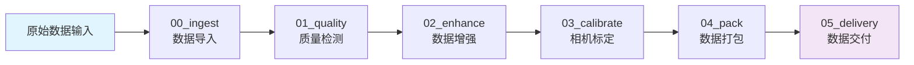

# Workshop 架构设计文档

## 📋 概述

Workshop 是 SpharxWorks 平台的核心数据采集和预处理子系统，采用模块化、容器化的架构设计，实现了从原始传感器数据到标准化高质量数据集的完整处理链路。作为物理世界数据工厂，Workshop 为后续的深度加工（Deepness）提供高质量的数据基础。

## 🏗️ 系统架构总览



## 🧩 核心模块详解

### 1. 00_ingest - 数据导入模块 ✅

#### 模块职责
接收和解析原始传感器数据，实现隐私脱敏处理和标准化数据结构生成。

#### 技术栈
- **硬件支持**: Intel RealSense SDK
- **计算机视觉**: OpenCV
- **数据格式**: ROS Bag、RealSense 数据流

#### 目录结构
```
pipelines/00_ingest/
├── Dockerfile              # 容器构建配置
├── requirements.txt        # Python 依赖清单
├── runner.py              # 主入口脚本
└── README.md              # 模块文档
```

#### 配置参数
```yaml
# common/configs/modules/00_ingest.yaml
privacy:
  enable_blur: true
  blur_kernel_size: 15
  face_detection: true

data_format:
  output_structure: "standard"
  compression_level: 6
```

#### 输入输出规范
- **输入**: `/data/raw/scene_xxx.bag` (原始ROS Bag文件)
- **输出**: `/data/processed/scene_xxx/`
  - `rgb/` - RGB图像序列
  - `depth/` - 深度图像序列
  - `calibration/` - 相机标定参数
  - `timestamps.csv` - 时间戳文件
  - `meta.json` - 场景元数据

---

### 2. 01_quality - 质量检测模块 ✅

#### 模块职责
多层次数据质量评估，包括硬件层检测和语义层分析。

#### 技术特点
- **硬件层检测**: 模糊度、曝光、帧率等基础质量指标
- **语义层分析**: 预留扩展接口

#### 配置参数
```yaml
# common/configs/modules/01_quality.yaml
hardware:
  load_config('quality_thresholds.yaml')

quality_check:
  enable_real_time: true
  save_reports: true
  report_format: "json"
```

#### 输出产物
- `quality_report.json` - 质量评估报告
- `quality_metrics/` - 详细质量指标数据

---

### 3. 02_enhance - 数据增强模块 ✅

#### 模块职责
基于目标检测的数据增强和自动标注生成。

#### 技术组成
- **目标检测**: YOLOv8 实时目标检测
- **图像处理**: 去噪、增强算法
- **标注生成**: COCO 格式自动标注

#### 配置参数
```yaml
# common/configs/modules/02_enhance.yaml
yolo:
  model: "yolov8n.pt"
  conf_threshold: 0.25
  iou_threshold: 0.45

enhancement:
  enable_denoising: true
  noise_reduction_strength: 0.3
```

#### 输出产物
- `annotations/` - COCO格式标注文件
- `enhanced_images/` - 增强后的图像
- `enhancement_report.json` - 增强处理报告

---

### 4. 03_calibrate - 相机标定模块 ✅

#### 模块职责
相机内外参标定，支持棋盘格标定法。

#### 技术特点
- **内参标定**: 焦距、主点、畸变参数
- **外参标定**: 预留多相机标定接口
- **精度验证**: 标定结果可靠性评估

#### 配置参数
```yaml
# common/configs/modules/03_calibrate.yaml
calibration:
  pattern_type: "chessboard"
  pattern_size: [9, 6]
  square_size: 0.025
  max_frames: 50
```

#### 输出产物
- `intrinsic_params.json` - 内参矩阵
- `extrinsic_params.json` - 外参矩阵
- `calibration_report.pdf` - 标定报告

---

### 5. 04_pack - 数据打包模块 ✅

#### 模块职责
标准化数据集打包和完整性校验。

#### 支持格式
- **ROS Bag**: 机器人操作系统标准格式
- **COCO**: 计算机视觉标准格式
- **自定义格式**: 可扩展的打包接口

#### 配置参数
```yaml
# common/configs/modules/04_pack.yaml
packaging:
  output_formats: ["ros", "coco"]
  compression_level: 6
  create_checksum: true

validation:
  verify_integrity: true
  generate_manifest: true
```

#### 输出产物
- `dataset_ros.bag` - ROS格式数据集
- `dataset_coco.zip` - COCO格式数据集
- `manifest.json` - 数据集清单
- `checksum.sha256` - 完整性校验和

---

### 6. 05_delivery - 数据交付模块 ⚡

#### 模块职责
数据集上传和交付，支持多种传输协议。

#### 交付方式
- **云存储**: 阿里云 OSS 对象存储
- **文件传输**: SFTP 安全文件传输
- **本地存储**: 本地文件系统

#### 配置参数
```yaml
# common/configs/modules/05_delivery.yaml
delivery:
  protocols: ["oss", "sftp"]
  retry_attempts: 3
  chunk_size_mb: 100

security:
  encrypt_data: true
  verify_checksum: true
```

#### 输出产物
- 上传状态报告
- 交付确认凭证
- 数据完整性验证报告

---

## 🐳 容器化架构

### 基础镜像设计
```
workshop-base:latest
├── Ubuntu 22.04 LTS
├── Python 3.10+
├── OpenCV 4.8+
├── Intel RealSense SDK
└── 核心Python包 (numpy, pyyaml, etc.)
```

### 服务编排 (docker-compose.yml)
```yaml
version: '3.8'
services:
  ingest:       # 数据导入服务
    image: workshop-ingest:latest
    depends_on: []
    
  quality:      # 质量检测服务
    image: workshop-quality:latest
    depends_on: [ingest]
    
  enhance:      # 数据增强服务
    image: workshop-enhance:latest
    depends_on: [quality]
    
  calibrate:    # 相机标定服务
    image: workshop-calibrate:latest
    depends_on: [enhance]
    
  pack:         # 数据打包服务
    image: workshop-pack:latest
    depends_on: [calibrate]
    
  delivery:     # 数据交付服务
    image: workshop-delivery:latest
    depends_on: [pack]
    profiles: [delivery]
```

### 数据卷挂载策略
```yaml
volumes:
  - ./produce/input/raw:/data/raw:ro          # 原始数据（只读）
  - ./produce/output/processed:/data/processed # 处理中间结果
  - ./produce/output/datasets:/data/datasets   # 最终数据集
  - ./common/configs:/app/common/configs:ro   # 配置文件（只读）
  - ./partdata/models:/data/models:ro         # 模型权重（只读）
```

---

## 🔄 数据流设计

### 标准数据流
```
原始数据输入 (L1)
        ↓
┌─────────────────┐
│   00_ingest     │
│  ? 数据导入      │
│  ? 隐私处理      │
└─────────────────┘
        ↓
┌─────────────────┐
│   01_quality    │
│  ? 质量检测      │
│  ? 指标评估      │
└─────────────────┘
        ↓
┌─────────────────┐
│   02_enhance    │
│  ? 目标检测      │
│  ? 数据增强      │
└─────────────────┘
        ↓
┌─────────────────┐
│  03_calibrate   │
│  ? 相机标定      │
│  ? 参数估计      │
└─────────────────┘
        ↓
┌─────────────────┐
│    04_pack      │
│  ? 格式打包      │
│  ? 完整性校验    │
└─────────────────┘
        ↓
┌─────────────────┐
│  05_delivery    │
│  ? 数据上传      │
│  ? 状态通知      │
└─────────────────┘
        ↓
标准化数据集输出 (L2)
```

### 错误处理机制
- **模块隔离**: 各模块独立容器，故障不相互影响
- **数据校验**: 每个环节都有输入输出校验
- **重试机制**: 支持配置化的失败重试策略
- **日志追踪**: 统一日志格式，便于问题定位

---

## ⚙️ 配置管理系统

### 配置层次结构
```
common/configs/
├── pipeline_config.yaml        # 全局流水线配置
├── modules/                    # 模块级配置
│   ├── 00_ingest.yaml         # 数据导入配置
│   ├── 01_quality.yaml        # 质量检测配置
│   ├── 02_enhance.yaml        # 数据增强配置
│   ├── 03_calibrate.yaml      # 相机标定配置
│   ├── 04_pack.yaml           # 数据打包配置
│   └── 05_delivery.yaml       # 数据交付配置
├── quality_thresholds.yaml     # 质量阈值配置
└── logging.yaml               # 日志配置
```

### 配置加载机制
```python
# common/scripts/config_loader.py
def load_global_config():      # 加载全局配置
def load_module_config(name):  # 加载模块配置
def validate_config(config):   # 配置验证
def merge_configs(base, override): # 配置合并
```

---

## 🧩 公共组件库

### 数据模型定义
```
common/schemas/
├── __init__.py
├── dataset.py      # 数据集模型
├── scene.py        # 场景元数据
├── sensor_stream.py # 传感器流模型
└── quality_report.py # 质量报告模型
```

### IO 工具集
```python
# common/scripts/data_io/
def load_bag_file(bag_path):     # ROS Bag文件加载
def save_dataset(dataset, path): # 数据集保存
def validate_data_integrity(path): # 数据完整性验证
def generate_manifest(data_path): # 清单文件生成
```

### 质量评估工具
```python
# common/scripts/quality_assessment/
def assess_image_quality(image): # 图像质量评估
def assess_motion_quality(traj): # 运动质量评估
def generate_quality_report(metrics): # 质量报告生成
```

---

## 🚀 部署运维

### 构建脚本
```bash
# scripts/build/workshop_build_all.sh
#!/bin/bash
# 一键构建所有 Workshop 镜像
docker-compose build
```

### 部署脚本
```bash
# scripts/deploy/workshop_deploy.sh
#!/bin/bash
# 生产环境部署
docker-compose up -d
```

### 依赖下载
```bash
# scripts/download/download_models.sh
# 下载预训练模型和大型依赖
wget -P ./partdata/models/ https://example.com/yolov8n.pt
```

### 环境清理
```bash
# scripts/dispose/dispose_build_all.sh
# 清理构建产物和缓存
docker system prune -af
```

---

## ⚡ 性能优化策略

### 资源管理
```yaml
# docker-compose.yml 性能配置
deploy:
  resources:
    limits:
      memory: 8G
      cpus: '4.0'
    reservations:
      memory: 4G
      cpus: '2.0'
```

### 并行处理
- **模块间并行**: 流水线并行处理不同场景
- **批次内并行**: 单个场景内图像批量处理
- **GPU加速**: YOLOv8推理使用GPU加速

### 缓存优化
- **模型缓存**: 预训练模型本地缓存
- **中间结果缓存**: 处理中间结果临时存储
- **依赖缓存**: Docker构建层缓存优化

---

## 🔒 安全与合规

### 容器安全
```dockerfile
# 基础镜像安全配置
FROM ubuntu:22.04

# 创建非root用户
RUN useradd -m -u 1000 appuser
USER appuser

# 最小权限原则
COPY --chown=appuser:appuser . /app
```

### 数据保护
- **隐私处理**: 自动人脸模糊和敏感信息过滤
- **访问控制**: 容器内最小权限原则
- **数据加密**: 敏感配置文件加密存储
- **完整性校验**: SHA256校验和验证

### 合规性
- **审计日志**: 完整的操作日志记录
- **版本控制**: 配置和代码版本管理
- **数据留存**: 符合数据保护法规要求

---

## 📈 开发路线图

### 当前状态
- ✅ 基础架构搭建完成 (v1.0.0.6)
- ✅ 六大核心模块功能完备
- ✅ Docker容器化部署就绪
- ✅ 配置管理系统成熟
- ⏳ 性能基准测试优化中
- 🔲 云原生部署支持

### 里程碑规划
```
v1.0.0.6 (当前) - 生产就绪版本
v1.1.0   - 性能优化和稳定性提升
v1.2.0   - 云原生部署支持
v2.0.0   - AI驱动的智能质检
v2.5.0   - 多模态数据融合处理
```

### 功能规划
- **短期** (3-6个月): 性能优化、稳定性提升
- **中期** (6-12个月): 云原生支持、智能质检
- **长期** (12+个月): 多模态融合、边缘部署

---

## 🔗 集成接口

### 与 Deepness 集成
- **数据输出**: 生成 Deepness 兼容的标准输入格式
- **触发机制**: 文件系统事件监听或 API 调用
- **状态同步**: 处理进度回调和状态通知
- **质量保证**: 确保输出数据满足深度加工要求

### 与外部系统集成
- **API接口**: RESTful API 支持外部调用
- **消息队列**: RabbitMQ/Kafka 消息中间件集成
- **监控告警**: Prometheus/Grafana 监控集成
- **日志收集**: ELK 栈日志收集分析

---

## 📚 参考资料

### 核心技术
- [Intel RealSense SDK](https://github.com/IntelRealSense/librealsense)
- [OpenCV 官方文档](https://opencv.org/)
- [YOLOv8 官方文档](https://docs.ultralytics.com/)
- [Docker 官方文档](https://docs.docker.com/)

### 标准规范
- [ROS (Robot Operating System)](http://wiki.ros.org/)
- [COCO Dataset Format](https://cocodataset.org/)
- [Camera Calibration Theory](https://docs.opencv.org/4.x/dc/dbb/tutorial_py_calibration.html)

### 最佳实践
- [ Twelve-Factor App](https://12factor.net/)
- [Docker 最佳实践](https://docs.docker.com/develop/)
- [微服务架构设计](https://microservices.io/)

---
*文档版本: v2.0*
*最后更新: 2026-02-28*